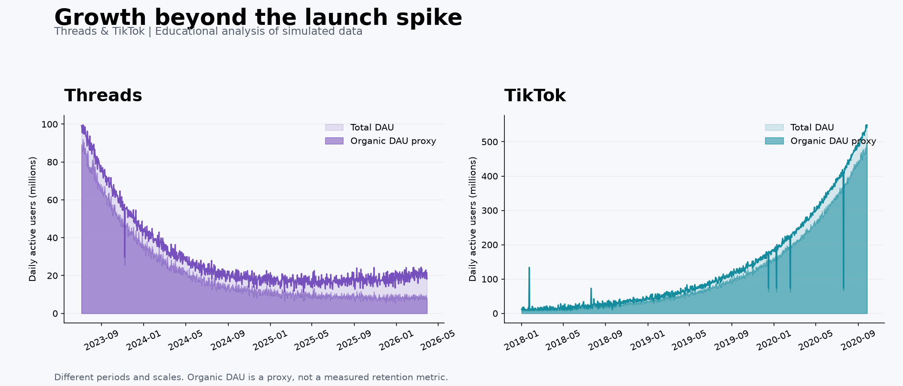

# Social Media Growth Analysis — Threads & TikTok

An open-source educational project by **Echo team**, exploring sustainable growth and temporary launch hype using simulated daily platform metrics.

## Echo team

- **Gheid Abdulkarim Abomaghara:** analysis, metrics and problem solving.
- **Rasha Abdulhameed Naji:** data collection and cleaning.
- **Elaf Hamed Alhajj:** presentation and visualization.

The original team deliverables are available unchanged: [Word study](docs/echo-study-original.docx) and [19-slide PowerPoint presentation](docs/echo-presentation-original.pptx).



The datasets represent **Threads and TikTok**. Twitter/X appears only as an external `twitter_volatility_index` feature in Threads data, not as a third platform dataset.

**The data is simulated**, not official platform analytics or scraped user data. Results describe the included simulation; correlations do not establish causation or actual company performance.

## Run locally

Use Python 3.12, from the repository root:

```bash
python -m venv .venv
# Windows PowerShell
.venv\Scripts\Activate.ps1
# macOS / Linux: source .venv/bin/activate
python -m pip install -r requirements.txt
python analysis.py
```

This exports cleaned data, Spearman correlation tables, a numerical summary and the comparison chart to `results/`, without API keys or network access. Open `echo notebook.ipynb` in Jupyter or VS Code, select the environment and restart/run all cells for the full original analysis.

## Contents

| File | Purpose |
| --- | --- |
| `echo notebook.ipynb` | Original exploratory notebook, repaired for sequential execution |
| `analysis.py` | Reproducible cleaning, numerical summary and chart export |
| `threads_light_dirty.csv` | Simulated Threads data with intentional quality issues |
| `tiktok_light_dirty (1).csv` | Simulated TikTok data with intentional quality issues |
| `results/` | Generated charts, cleaned data and correlation tables |
| [Study](docs/STUDY.md) | Methodology, interpretation and limitations |
| [Original study notes](docs/original-study-notes.md) | Preserved original README; approximate claims are not independently validated |

## Methodology

Each raw CSV contains 1,005 rows. Shared fields: `date`, `dau`, `avg_session_duration_min`, `churn_rate`, `organic_traffic_pct`. Threads adds `twitter_volatility_index`; TikTok adds `algorithm_efficiency_score`.

Remove duplicates and invalid dates; drop missing Threads observations; median-impute missing TikTok DAU/churn. Retain the original assumptions of replacing non-positive DAU with the positive mean and taking absolute negative churn. These are educational assumptions, not verified corrections of business observations.

Spearman correlations summarize monotonic associations. The illustrative organic DAU proxy is `DAU × organic traffic percentage / 100`. Acquisition traffic and active-user populations differ, so this is not a measured retention metric.

The original study frames Threads as a launch-spike scenario and TikTok as a growing scenario. Recomputed results are in `results/summary.json`. Different calendar periods, scales and shared time trends limit comparisons. Proposed bubble-warning thresholds remain unvalidated research hypotheses, not an implemented detection system.

The original Word study lists Business of Apps, Statista, Similarweb and Sensor Tower as inspiration for simulated data. See its source statement. No simulation generator is supplied, so data provenance cannot be fully reproduced from those references. Original document figures are historical claims; recomputed coefficients are in `results/summary.json` and may differ.

## Open source

Code, repository documentation and included simulated datasets use the [MIT License](LICENSE). The original collaborative Word and PowerPoint deliverables retain their authors' rights and are not relicensed by that license. Contributions are welcome; see [CONTRIBUTING.md](CONTRIBUTING.md).

## ملخص عربي

مشروع مفتوح المصدر لتحليل بيانات نمو محاكاة لمنصتي Threads وTikTok، من إعداد فريق Echo. دور غيد عبدالكريم: التحليل والمقاييس وحل المشكلات. يضم تنظيف البيانات والتحليل الاستكشافي وارتباط Spearman والرسوم المقارنة والدراسة والعرض الأصليين. Twitter/X عامل خارجي في بيانات Threads فقط. البيانات تعليمية وليست قياسات حقيقية للمنصات، والارتباط لا يثبت السببية.
